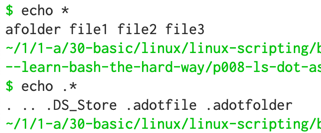

# Working with *

```
$ ls .*
```

The asterisk (*) above match:

```
'file-name'
'folder-name/'
'.'
''
```


## Show dot and non-dot items

```
echo .*  # show dot item
echo *   # show non-dot item
```


## Show one item per line

Pipe to `tr` to show one item per line:

```
echo .* * | tr ' ' '\n'
```


